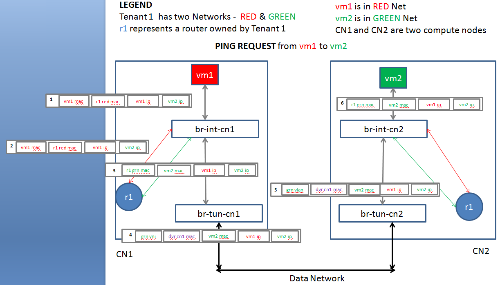
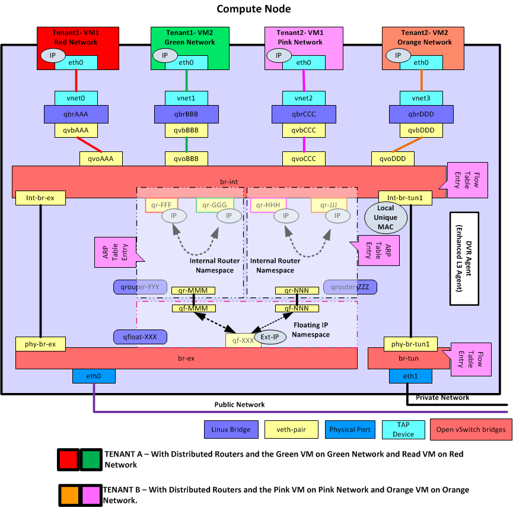

## 计算节点
需要额外启用 l3_agent（dvr 模式），以及 metadata agent。

其实，跟传统情况下的网络节点十分类似。每个路由器有自己的命名空间，负责跨子网的转发。

### [东西流量](https://wiki.openstack.org/wiki/Neutron/DVR_L2_Agent)


如上图所示，租户两个子网，红色和绿色，分别有 vm1 和 vm2，位于节点 cn1 和 cn2 上。

vm1 访问 vm2 的网包如步骤 1-6，整个过程 ip 保持不变。

* 原始包，vm1 访问 vm2，目的 mac 为本地（红网）的路由器网关接口 `r1 red mac`；
* 经过 br-int-cn1 转发，该网包通过本地（红网）网关接口扔给本地路由器 r1。
* r1 根据路由规则，经过到绿网的接口发出，此时网包的源 mac 改为绿网的网关接口 `r1 grn mac`，目的 mac 改为 `vm2 mac`，并且带上绿网的本地 vlan tag；
* 网包发给 br-tun-cn1 进行 tunnel，扔出去之前，将源 mac 替换为跟节点相关的特定 mac `dvr cn1 mac`，之后带着目标子网（绿网）的 外部 tunnel id 扔出去（实现可以为 vlan、vxlan、gre 等，功能都是一样的）；
* 节点 cn2 的网桥 br-tun-cn2 会从 tunnel 收到这个包，解封包，带上本地 vlan tag，最终抵达网桥 br-int-cn2；
* br-int-cn2 上替换网包的源 mac（此时为 dvr-cn1-mac）为本地路由器的绿网网关接口，然后发给 vm2。

返回包的过程正好是反过来。虽然实现上略复杂，但整个过程还是比较清晰的，保证 vm1 和 vm2 感觉到的都是直接跟路由器的接口相连（分别为红网网关接口和绿网网关接口）。


### 南北流量



所不同的是，单独有一个 qfloat-XXX 路由器（也在一个独立命名空间中）来负责处理带有 floating IP 的南北向流量。


### 流表规则
为了实现上面描述的这些功能，需要下面几种流表规则。

#### 所有对网关的 arp request 不能出到外部网络
在 tunnel 网桥上看到的一律丢弃。
```sh
DVR PROCESS Table 1 (New table for dvr):
table=1, priority=4, dl_vlan= red1-L-vlan, dl_type=arp, ar_tpa= r1-red-ip actions: drop
table=1, priority=4, dl_vlan= grn1-L-vlan, dl_type=arp, ar_tpa= r1-grn-ip actions: drop
```

#### 所有发往网关的包也不能出到外部网络
在 tunnel 网桥上看到的一律丢弃。
```sh
DVR PROCESS Table 1 (New table for dvr):
table=1, priority=2, dl_vlan=red2_L_vlan, dl_dst=r1-red-mac, actions: drop
table=1, priority=2 , dl_vlan=grn2_L_vlan, dl_dst=r1-grn-mac, actions: drop
```

#### 所有从路由器接口路由出去的包，需要修改源 mac 为特殊 mac
在 tunnel 网桥上进行处理。
```sh
DVR PROCESS Table 1 (New table for dvr):
table=1, priority=1, dl_vlan=red2_L_vlan, dl_src=r1-red-mac, actions: mod_dl_src=dvr-cn1-mac, resubmit(,2)
table=1, priority=1, dl_vlan=grn2_L_vlan, dl_src=r1-grn-mac, actions: mod_dl_src=dvr-cn1-mac, resubmit (,2)
```

#### 同样，收到外部特殊源 mac 的包要修改为正确的路由器接口 mac
在 integration 网桥上进行处理。
```sh
Table 0: (Local switching table)
table=0, priority=2, in_port=patch-tun, dl_src=dvr-cn1-mac actions: goto table 1
table=0, priority=1, actions: output->NORMAL

Table 1: (DVR_TO_LOCALMAC table)
table=1, priority=2, dl_vlan=grn2-L-vlan, nw_dst=grn-subnet actions: strip_vlan, mod_dl_src=r1-grn-MAC,output->port-vm2
table=1, priority=1 actions: drop
```

此外，还有一些优化措施，包括：

采用 L2 pre-population 技术，提前把相关计算节点的地址关系放到本地的 FDB 表中，减少外部广播。

在 integration 网桥上，采用组表来调整规则顺序等。
```sh
Table 1: (DVR_TO_LOCALMAC table)
table=1, priority=2, dl_vlan=grn2-L-vlan, nw_dst=grn-subnet actions: strip_vlan, mod_dl_src=r1-grn-MAC,output->port-vm2
```

### 注意事项

这里面比较重要的地方，是允许有多个同样的网关存在于多个计算节点（同一子网跨多个物理节点导致）的情况下，保证：
* 要让本地的请求找到本地的路由器；
* 要避免路由器的接口 mac 地址直接暴露到外部网络上。

要解决这两个问题，首先是合理处理好本地的 ARP 请求，让本地对网关的请求拦截发给本地的路由器。同时，路由器路由后的网包，发到外部网络之前，先用一个跟节点绑定的特殊 mac 替换掉源 mac。这个 mac 地址是控制器为每个计算节点单独分配的唯一地址。

如果不允许同一子网跨多个物理节点，则每个节点上的路由器就不会冲突，设计起来就简单的多，比如 [kubernetes 中的网络](http://blog.csdn.net/yeasy/article/details/46443933)。


