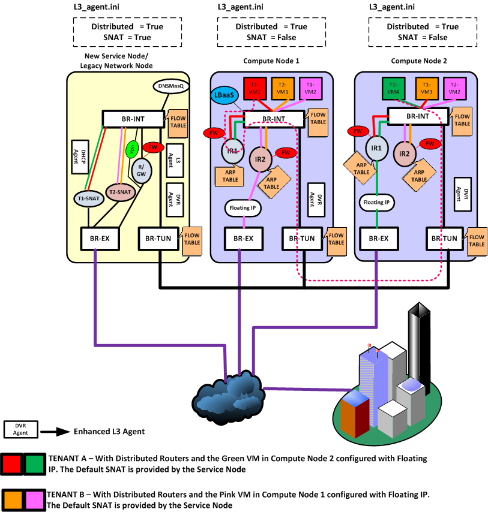
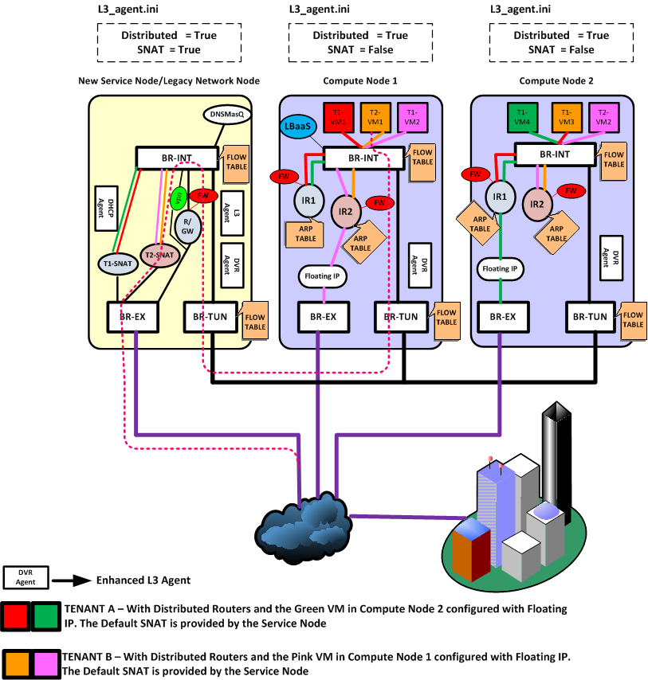
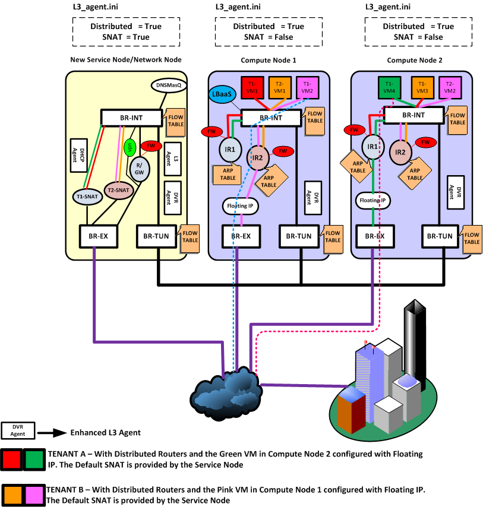

## 典型场景

从网络的访问看，涉及到路由服务的至少是需要跨子网的访问，又包括是否是同一机器、是否是涉及到外网（东西向 vs 南北向）。

考虑下面几个典型的场景。

### 东西向

#### 同一机器

#### 不同机器

如图所示，租户 T1 的两个不同子网的 vm：VM1 和 VM4 在不同机器上，VM1 要访问 VM4，则 IR1 起到连接两个子网的路由器功能。

### 南北向

#### 无 floating IP
这种情况（即 SNAT）下，跟传统模式很类似。

租户 T2 在外部，通过默认的 SNAT 网关访问内部子网的 vm VM1。此时，网络节点上的 T2-SNAT 起到路由器的作用

反过来，租户 T2 内部子网的 vm VM1 试图访问外部网络，则仍然经过网络节点上的 T2-SNAT 路由器。

为何这种情况下必须从网络节点走？这是因为对于外部网络来说，看到的都是外部接口的地址，这个地址只有一个。

当然，如果以后每个计算节点上都可以带有这样一个 SNAT 默认外部地址的话，这种情况下的流量也是可以直接从计算节点出去的。

#### 有 floating IP

这种情况下，计算节点上的专门负责的外部路由器将负责进行转发，即计算节点 1 上的 IR2 和计算节点 2 上的 IR1。
