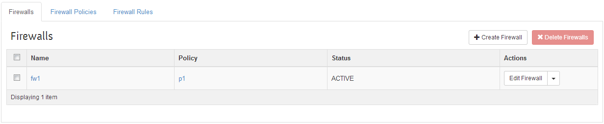
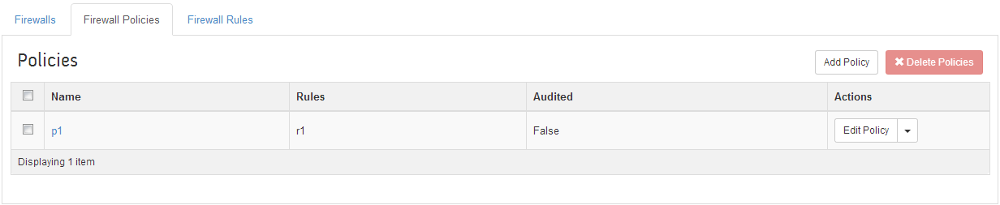
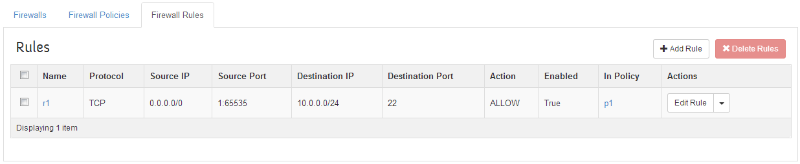

## 典型场景
典型的场景，租户创建了一个网络，并在其上分配了一个子网 10.0.0.0/24，默认情况下，其它子网将不允许访问该子网。租户试图通过防火墙规则来允许外部网络对内部子网虚拟机 22 端口的访问。

OpenStack 的 FWaaS 实现中有三个重要概念：
* Firewall
* Policy
* Rule

其中，Firewall 会绑定到某个 Policy（因此必须先创建 Policy 之后才能创建一个 Firewall）。

Policy 中可以包括若干条 Rule。

Rule 即访问控制的规则，包括源和目的子网、源和目的端口、协议、行动等。

例如，我们创建一个 Rule，允许其它网络对内部子网中虚机端口 22 的 TCP 请求。

