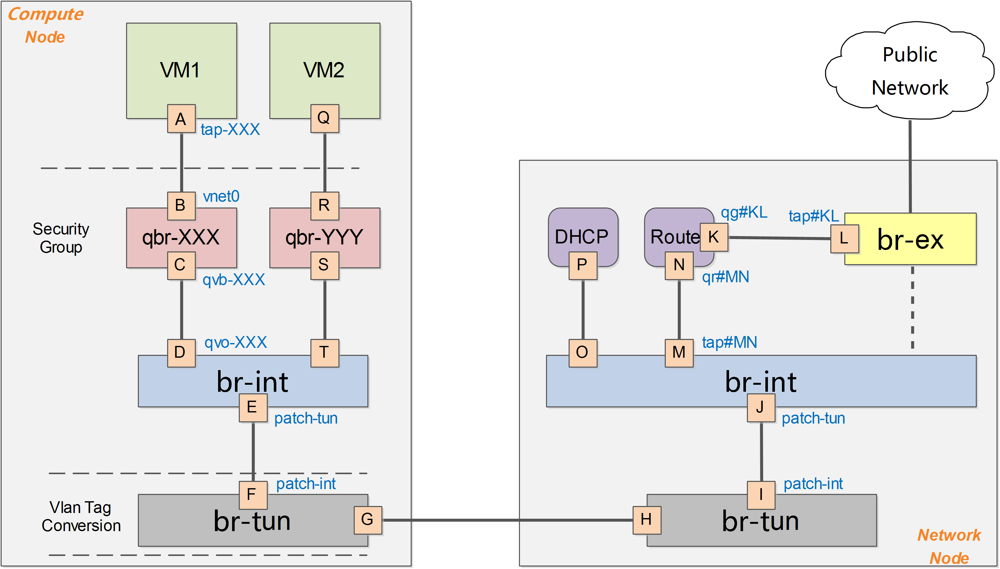

# GRE 模式
下图给出了在OpenStack中网络实现的一个简化的架构示意。

一般的，OpenStack中网络实现包括vlan、gre、vxlan 等模式，此处以gre模式为例。

在OpenStack中，所有网络有关的逻辑管理均在Network节点中实现，例如DNS、DHCP以及路由等。Compute节点上只需要对所部属的虚拟机提供基本的网络功能支持，包括隔离不同租户的虚拟机和进行一些基本的安全策略管理（即security group）。
