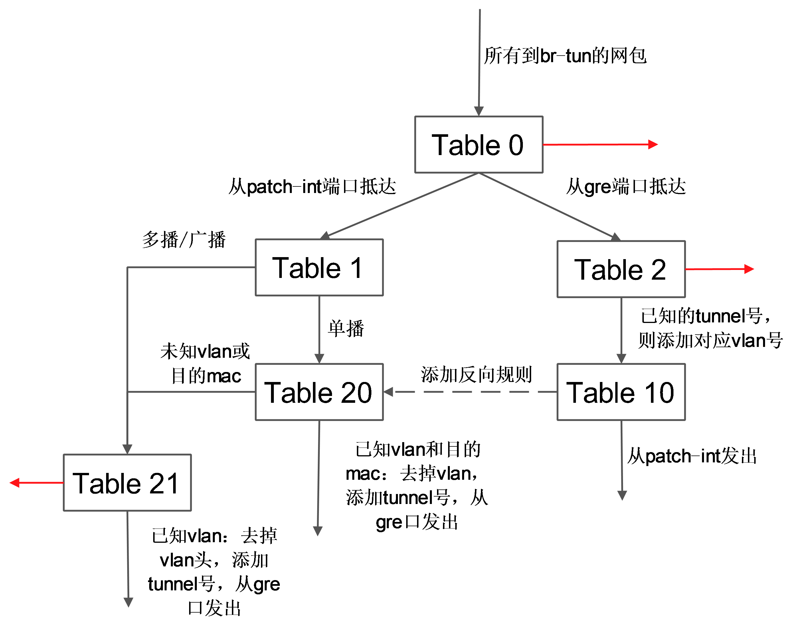

## 计算节点
以抽象系统架构的图表为例，Compute 节点上包括两台虚拟机 VM1 和 VM2，分别经过一个网桥（如 qbr-XXX）连接到 br-int 网桥上。br-int 网桥再经过 br-tun 网桥（物理网络是 GRE 实现）连接到物理主机外部网络。

对于物理网络通过 vlan 来隔离的情况，则一般会存在一个 br-eth 网桥，替代 br-tun 网桥。

### qbr
在 VM1 中，虚拟机的网卡实际上连接到了物理机的一个 TAP 设备（即 A，常见名称如 tap-XXX）上，A 则进一步通过VETH pair（A-B）连接到网桥 qbr-XXX 的端口 vnet0（端口 B）上，之后再通过 VETH pair（C-D）连到br-int网桥上。一般C的名字格式为 qvb-XXX，而 D 的名字格式为 qvo-XXX。注意它们的名称除了前缀外，后面的 id 都是一样的，表示位于同一个虚拟机网络到物理机网络的连接上。

之所以 TAP 设备 A 没有直接连接到网桥br-int上，是因为 OpenStack 需要通过 iptables 实现 security group 的安全策略功能。目前 openvswitch 并不支持应用 iptables 规则的 Tap 设备。

因为 qbr 的存在主要是为了辅助 iptables 来实现 security group功能，有时候也被称为`安全网桥`。详见 security group 部分的分析。

### br-int
一个典型的 br-int 的端口如下所示：
```
# ovs-vsctl show
Bridge br-int
    Port "qvo-XXX"
        tag: 1
        Interface "qvo-XXX"
    Port patch-tun
        Interface patch-tun
            type: patch
            options: {peer=patch-int}
    Port br-int
        Interface br-int
            type: internal
```
其中，
* br-int 为内部端口。
* patch-tun（即端口E，端口号为1）连接到 br-tun 上，实现到外部网络的隧道。
* qvo-XXX（即端口D，端口号为2）带有 tag1，说明这个口是一个1号 vlan 的 access 端口。虚拟机发出的从该端口到达br-int的网包将被自动带上vlan tag 1，而其他带有 vlan tag 1 的网包则可以在去掉 vlan tag 后从该端口发出（即 vlan access 端口）。这个 vlan tag 是用来实现不同网络相互隔离的，比如租户创建一个网络（neutron net-create），则会被分配一个唯一的 vlan tag。

br-int 在 GRE 模式中作为一个 NORMAL 交换机使用，因此有效规则只有一条正常转发。如果两个在同一主机上的 vm 属于同一个 tenant 的（同一个 vlan tag），则它们之间的通信只需要经过 br-int 即可。
```sh
# ovs-ofctl dump-flows br-int
NXST_FLOW reply (xid=0x4):
 cookie=0x0, duration=10727.864s, table=0, n_packets=198, n_bytes=17288, idle_age=13, priority=1 actions=NORMAL
```
### br-tun
一个典型的 br-tun 上的端口类似：
```sh
Bridge br-tun
        Port patch-int
            Interface patch-int
                type: patch
                options: {peer=patch-tun}
        Port "gre-1"
            Interface "gre-1"
                type: gre
                options: {in_key=flow, local_ip="10.0.0.101", out_key=flow, remote_ip="10.0.0.100"}
        Port br-tun
            Interface br-tun
                type: internal
```
其中，
* patch-int（即端口 F，端口号为1）是连接到 br-int 上的 veth pair 的端口
* gre-1 端口（即端口 G，端口号为2）对应vm到外面的隧道。gre-1 端口是虚拟 gre 端口，当网包发送到这个端口的时候，会经过内核封包，然后从 10.0.0.101 发送到 10.0.0.100，即从本地的物理网卡（10.0.0.101）发出。

br-tun将带有 vlan tag 的 vm 跟外部通信的流量转换到对应的 gre 隧道，这上面要实现主要的转换逻辑，规则要复杂，一般通过多张表来实现。

典型的转发规则为：
```sh
# ovs-ofctl dump-flows br-tun
NXST_FLOW reply (xid=0x4):
 cookie=0x0, duration=10970.064s, table=0, n_packets=189, n_bytes=16232, idle_age=16, priority=1,in_port=1 actions=resubmit(,1)
 cookie=0x0, duration=10906.954s, table=0, n_packets=29, n_bytes=5736, idle_age=16, priority=1,in_port=2 actions=resubmit(,2)
 cookie=0x0, duration=10969.922s, table=0, n_packets=3, n_bytes=230, idle_age=10962, priority=0 actions=drop
 cookie=0x0, duration=10969.777s, table=1, n_packets=26, n_bytes=5266, idle_age=16, priority=0,dl_dst=00:00:00:00:00:00/01:00:00:00:00:00 actions=resubmit(,20)
 cookie=0x0, duration=10969.631s, table=1, n_packets=163, n_bytes=10966, idle_age=21, priority=0,dl_dst=01:00:00:00:00:00/01:00:00:00:00:00 actions=resubmit(,21)
 cookie=0x0, duration=688.456s, table=2, n_packets=29, n_bytes=5736, idle_age=16, priority=1,tun_id=0x1 actions=mod_vlan_vid:1,resubmit(,10)
 cookie=0x0, duration=10969.488s, table=2, n_packets=0, n_bytes=0, idle_age=10969, priority=0 actions=drop
 cookie=0x0, duration=10969.343s, table=3, n_packets=0, n_bytes=0, idle_age=10969, priority=0 actions=drop
 cookie=0x0, duration=10969.2s, table=10, n_packets=29, n_bytes=5736, idle_age=16, priority=1 actions=learn(table=20,hard_timeout=300,priority=1,NXM_OF_VLAN_TCI[0..11],NXM_OF_ETH_DST[]=NXM_OF_ETH_SRC[],load:0->NXM_OF_VLAN_TCI[],load:NXM_NX_TUN_ID[]->NXM_NX_TUN_ID[],output:NXM_OF_IN_PORT[]),output:1
 cookie=0x0, duration=682.603s, table=20, n_packets=26, n_bytes=5266, hard_timeout=300, idle_age=16, hard_age=16, priority=1,vlan_tci=0x0001/0x0fff,dl_dst=fa:16:3e:32:0d:db actions=load:0->NXM_OF_VLAN_TCI[],load:0x1->NXM_NX_TUN_ID[],output:2
 cookie=0x0, duration=10969.057s, table=20, n_packets=0, n_bytes=0, idle_age=10969, priority=0 actions=resubmit(,21)
 cookie=0x0, duration=688.6s, table=21, n_packets=161, n_bytes=10818, idle_age=21, priority=1,dl_vlan=1 actions=strip_vlan,set_tunnel:0x1,output:2
 cookie=0x0, duration=10968.912s, table=21, n_packets=2, n_bytes=148, idle_age=689, priority=0 actions=drop
```
#### 表 0
其中，表 0 中有 3 条规则：从内部端口 1（即patch-int）来的，扔到表 1，从外部端口2（即 gre-1）来的，扔到表2。
```sh
cookie=0x0, duration=10970.064s, table=0, n_packets=189, n_bytes=16232, idle_age=16, priority=1,in_port=1 actions=resubmit(,1)
 cookie=0x0, duration=10906.954s, table=0, n_packets=29, n_bytes=5736, idle_age=16, priority=1,in_port=2 actions=resubmit(,2)
 cookie=0x0, duration=10969.922s, table=0, n_packets=3, n_bytes=230, idle_age=10962, priority=0 actions=drop
```
#### 表 1
表 1 处理内部过来的网包，有 2 条规则：如果是单播（00:00:00:00:00:00/01:00:00:00:00:00），则扔到表 20；如果是多播等（01:00:00:00:00:00/01:00:00:00:00:00），则扔到表 21。
```
cookie=0x0, duration=10969.777s, table=1, n_packets=26, n_bytes=5266, idle_age=16, priority=0,dl_dst=00:00:00:00:00:00/01:00:00:00:00:00 actions=resubmit(,20)
 cookie=0x0, duration=10969.631s, table=1, n_packets=163, n_bytes=10966, idle_age=21, priority=0,dl_dst=01:00:00:00:00:00/01:00:00:00:00:00 actions=resubmit(,21)
```
#### 表 2
表 2 处理外部过来的包。有 2 条规则：如果是 tunnel 1（合法的 tunnel id）的网包，则修改其 vlan id 为1，并扔到表 10 学习记录来源；非 tunnel 1（非法的 tunnel id）的网包，则丢弃。
```sh
cookie=0x0, duration=688.456s, table=2, n_packets=29, n_bytes=5736, idle_age=16, priority=1,tun_id=0x1 actions=mod_vlan_vid:1,resubmit(,10)
 cookie=0x0, duration=10969.488s, table=2, n_packets=0, n_bytes=0, idle_age=10969, priority=0 actions=drop
```
#### 表 3
表 3 只有 1 条规则：丢弃。

#### 表 10
表 10 负责学习。有一条规则，基于 learn 行动来创建反向（内部网包从 gre 端口发出去）的规则。learn 行动并非标准的 openflow 行动，是 openvswitch 自身的扩展行动，这个行动可以根据流内容动态来修改流表内容。

这条规则首先创建了一条新的流（该流对应 vm 从 br-tun 的 gre 端口发出的规则）：其中 table=20 表示规则添加在表 20；NXM_OF_VLAN_TCI[0..11] 表示匹配包自带的v lan id；NXM_OF_ETH_DST[]=NXM_OF_ETH_SRC[] 表示 L2 目标地址需要匹配当前包的 L2 源地址；load:0->NXM_OF_VLAN_TCI[]，去掉vlan，load:NXM_NX_TUN_ID[]->NXM_NX_TUN_ID[]，添加 tunnel 号为原始 tunnel 号；output:NXM_OF_IN_PORT[]，发出端口为原始包抵达的端口。

向表 20 添加完规则后，最后将匹配的当前网包从端口 1（即 patch-int）发出。
```sh
cookie=0x0, duration=10969.2s, table=10, n_packets=29, n_bytes=5736, idle_age=16, priority=1 actions=learn(table=20,hard_timeout=300,priority=1,NXM_OF_VLAN_TCI[0..11],NXM_OF_ETH_DST[]=NXM_OF_ETH_SRC[],load:0->NXM_OF_VLAN_TCI[],load:NXM_NX_TUN_ID[]->NXM_NX_TUN_ID[],output:NXM_OF_IN_PORT[]),output:1
```

#### 表 20
表 20 中有两条规则，其中第一条即表 10 中规则利用 learn 行动创建的内部向外部发包的流表项，第 2 条提交其他流到表 21。
```
cookie=0x0, duration=682.603s, table=20, n_packets=26, n_bytes=5266, hard_timeout=300, idle_age=16, hard_age=16, priority=1,vlan_tci=0x0001/0x0fff,dl_dst=fa:16:3e:32:0d:db actions=load:0->NXM_OF_VLAN_TCI[],load:0x1->NXM_NX_TUN_ID[],output:2
 cookie=0x0, duration=10969.057s, table=20, n_packets=0, n_bytes=0, idle_age=10969, priority=0 actions=resubmit(,21)
```
表21有2条规则，第一条是匹配所有目标vlan为1的网包，去掉vlan，然后从端口2（gre 端口）发出。第二条是丢弃。
```
cookie=0x0, duration=688.6s, table=21, n_packets=161, n_bytes=10818, idle_age=21, priority=1,dl_vlan=1 actions=strip_vlan,set_tunnel:0x1,output:2
 cookie=0x0, duration=10968.912s, table=21, n_packets=2, n_bytes=148, idle_age=689, priority=0 actions=drop
```
这些规则所组成的整体转发逻辑如下图所示。


