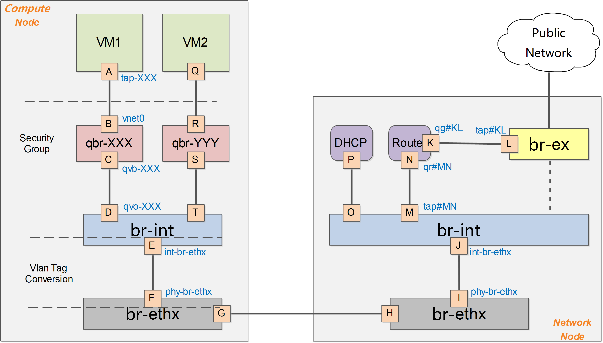
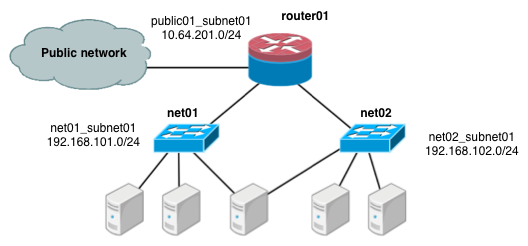

# VLAN 模式
Vlan模式下的系统架构跟GRE模式下类似，如下图所示。

需要注意的是，在vlan模式下，vlan tag的转换需要在br-int和br-ethx两个网桥上进行相互配合。即br-int负责从int-br-ethX过来的包（带外部vlan）转换为内部vlan，而br-ethx负责从phy-br-ethx过来的包（带内部vlan）转化为外部的vlan。

下面进行一些细节的补充讨论，以Vlan作为物理网络隔离的实现。假如要实现同一个租户下两个子网，如下图所示：

