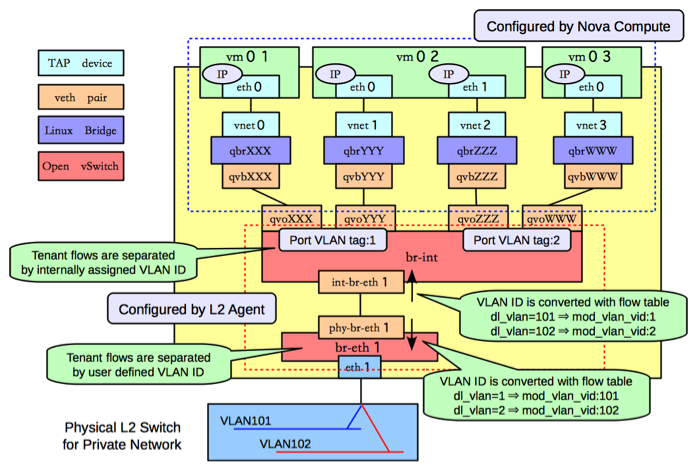

## 计算节点

查看网桥信息，主要包括两个网桥：br-int和br-eth1：
```sh
[root@Compute ~]# ovs-vsctl show
f758a8b8-2fd0-4a47-ab2d-c49d48304f82
    Bridge "br-eth1"
        Port "phy-br-eth1"
            Interface "phy-br-eth1"
        Port "br-eth1"
            Interface "br-eth1"
                type: internal
        Port "eth1"
            Interface "eth1"
    Bridge br-int
        Port "qvoXXX"
            tag: 1
            Interface "qvoXXX"
Port "qvoYYY"
            tag: 1
            Interface "qvoYYY"
Port "qvoZZZ"
     tag: 2
     Interface "qvoZZZ"
Port "qvoWWW"
     tag: 2
     Interface "qvoWWW"
        Port "int-br-eth1"
            Interface "int-br-eth1"
        Port br-int
            Interface br-int
                type: internal
```
类似GRE模式下，br-int负责租户隔离，br-eth1负责跟计算节点外的网络通信。
在Vlan模式下，租户的流量隔离是通过vlan来进行的，因此此时包括两种vlan，虚拟机在Compute Node内流量带有的local vlan和在Compute Node之外物理网络上隔离不同租户的vlan。

br-int和br-eth1分别对从端口int-br-eth1和phy-br-eth1上到达的网包进行vlan tag的处理。此处有两个网，分别带有两个vlan tag（内部tag1对应外部tag101，内部tag2对应外部tag102）。
其中，安全组策略仍然在qbr相关的iptables上实现。

### br-int
与GRE模式不同的是，br-int完成从br-eth1上过来流量（从口int-br-eth1到达）的vlan tag转换，可能的规则为
```sh
#ovs-ofctl dump-flows br-int
 cookie=0x0, duration=100.795s, table=0, n_packets=6, n_bytes=468, idle_age=90, priority=2,in_port=3 actions=drop
 cookie=0x0, duration=97.069s, table=0, n_packets=22, n_bytes=6622, idle_age=31, priority=3,in_port=3,dl_vlan=101 actions=mod_vlan_vid:1,NORMAL
 cookie=0x0, duration=95.781s, table=0, n_packets=8, n_bytes=1165, idle_age=11, priority=3,in_port=3,dl_vlan=102 actions=mod_vlan_vid:2,NORMAL
 cookie=0x0, duration=103.626s, table=0, n_packets=47, n_bytes=13400, idle_age=11, priority=1 actions=NORMAL
```

### br-eth1
br-eth1上负责从br-int上过来的流量（从口phy-br-eth1到达），实现local vlan到外部vlan的转换。
```sh
#ovs-ofctl dump-flows br-eth0
NXST_FLOW reply (xid=0x4):
 cookie=0x0, duration=73.461s, table=0, n_packets=51, n_bytes=32403, idle_age=2, hard_age=65534, priority=4,in_port=4,dl_vlan=1 actions=mod_vlan_vid:101,NORMAL
 cookie=0x0, duration=83.461s, table=0, n_packets=51, n_bytes=32403, idle_age=2, hard_age=65534, priority=4,in_port=4,dl_vlan=2 actions=mod_vlan_vid:102,NORMAL
 cookie=0x0, duration=651.538s, table=0, n_packets=72, n_bytes=3908, idle_age=2574, hard_age=65534, priority=2,in_port=4 actions=drop
 cookie=0x0, duration=654.002s, table=0, n_packets=31733, n_bytes=6505880, idle_age=2, hard_age=65534, priority=1 actions=NORMAL
```
