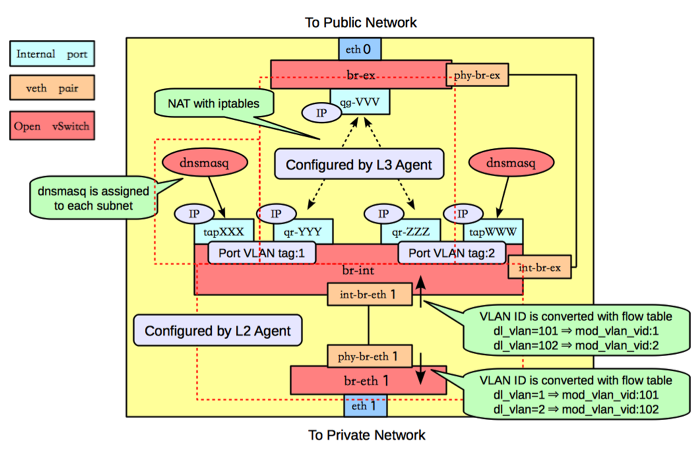
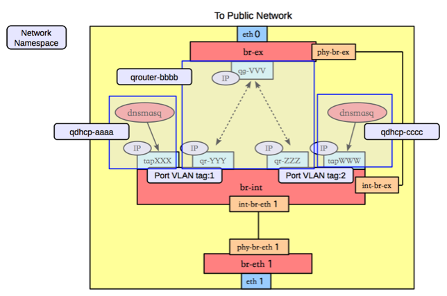
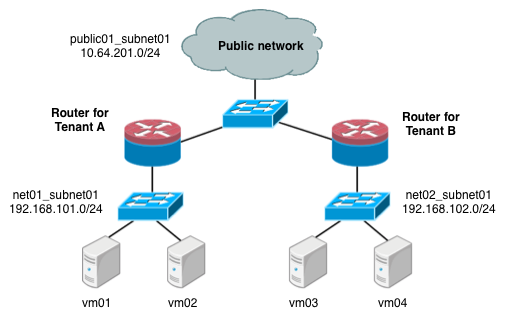
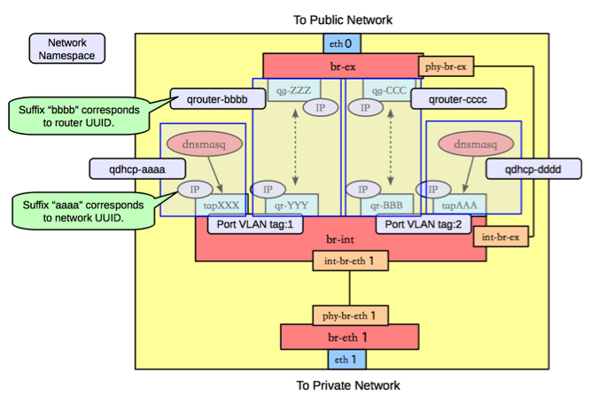

## 网络节点


类似GRE模式下，br-eth1收到到达的网包，int-br-eth1和phy-br-eth1上分别进行vlan转换，保证到达br-int上的网包都是带有内部vlan tag，到达br-eth1上的都是带有外部vlan tag。br-ex则完成到OpenStack以外网络的连接。
查看网桥信息，包括三个网桥，br-eth1、br-int和br-ex。
```sh
#ovs
3bd78da8-d3b5-4112-a766-79506a7e2801
    Bridge br-ex
        Port "qg-VVV"
            Interface "qg-VVV"
                type: internal
        Port br-ex
            Interface br-ex
                type: internal
        Port "eth0"
            Interface "eth0"
    Bridge br-int
        Port br-int
            Interface br-int
                type: internal
        Port "int-br-eth1"
            Interface "int-br-eth0"
        Port "tapXXX"
            tag: 1
            Interface "tapXXX"
                type: internal
Port "tapWWW"
            tag: 2
            Interface "tapWWW"
                type: internal
        Port "qr-YYY"
            tag: 1
            Interface "qr-YYY"
                type: internal
        Port "qr-ZZZ"
            tag: 2
            Interface "qr-ZZZ"
                type: internal
    Bridge "br-eth1"
        Port "phy-br-eth1"
            Interface "phy-br-eth1"
        Port "br-eth1"
            Interface "br-eth1"
                type: internal
        Port "eth1"
            Interface "eth1"
```

### br-eth1
br-eth1主要负责把物理网络上外部vlan转化为local vlan。
```sh
#ovs-ofctl dump-flows br-eth1
NXST_FLOW reply (xid=0x4):
 cookie=0x0, duration=144.33s, table=0, n_packets=13, n_bytes=28404, idle_age=24, hard_age=65534, priority=4,in_port=5,dl_vlan=101 actions=mod_vlan_vid:1,NORMAL
 cookie=0x0, duration=144.33s, table=0, n_packets=13, n_bytes=28404, idle_age=24, hard_age=65534, priority=4,in_port=5,dl_vlan=102 actions=mod_vlan_vid:2,NORMAL
 cookie=0x0, duration=608.373s, table=0, n_packets=23, n_bytes=1706, idle_age=65534, hard_age=65534, priority=2,in_port=5 actions=drop
 cookie=0x0, duration=675.373s, table=0, n_packets=58, n_bytes=10625, idle_age=24, hard_age=65534, priority=1 actions=NORMAL
```
###	br-int
br-int上挂载了大量的agent来提供各种网络服务，另外负责对发往br-eth1的流量，实现local vlan转化为外部vlan。
```sh
#ovs-ofctl dump-flows br-int
NXST_FLOW reply (xid=0x4):
 cookie=0x0, duration=147294.121s, table=0, n_packets=224, n_bytes=33961, idle_age=13, hard_age=65534, priority=3,in_port=4,dl_vlan=1 actions=mod_vlan_vid:101,NORMAL
 cookie=0x0, duration=603538.84s, table=0, n_packets=19, n_bytes=2234, idle_age=18963, hard_age=65534, priority=2,in_port=4 actions=drop
 cookie=0x0, duration=603547.134s, table=0, n_packets=31901, n_bytes=6419756, idle_age=13, hard_age=65534, priority=1 actions=NORMAL
```
dnsmasq负责提供DHCP服务，绑定到某个特定的名字空间上，每个需要DHCP服务的租户网络有自己专属隔离的DHCP服务（图中的tapXXX和tapWWW上各自监听了一个dnsmasq）。

路由是L3 agent来实现，每个子网在br-int上有一个端口（qr-YYY和qr-ZZZ，已配置IP，分别是各自内部子网的网关），L3 agent绑定到上面。要访问外部的公共网络，需要通过L3 agent发出，而不是经过int-br-ex到phy-br-ex（实际上并没有网包从这个veth pair传输）。如果要使用外部可见的floating IP，L3 agent仍然需要通过iptables来进行NAT。

每个L3 agent或dnsmasq都在各自独立的名字空间中，如下图所示，其中同一租户的两个子网都使用了同一个路由器。



对于子网使用不同路由器的情况，多个路由器会在自己独立的名字空间中。例如要实现两个租户的两个子网的情况，如下图所示。



这种情况下，网络节点上的名字空间如下图所示。


### br-ex
br-ex要做的事情很简单，只需要正常转发即可。
```sh
#ovs-ofctl dump-flows br-ex
NXST_FLOW reply (xid=0x4):
 cookie=0x0, duration=6770.969s, table=0, n_packets=5411, n_bytes=306944, idle_age=0, hard_age=65534, priority=0 actions=NORMAL
 ```
